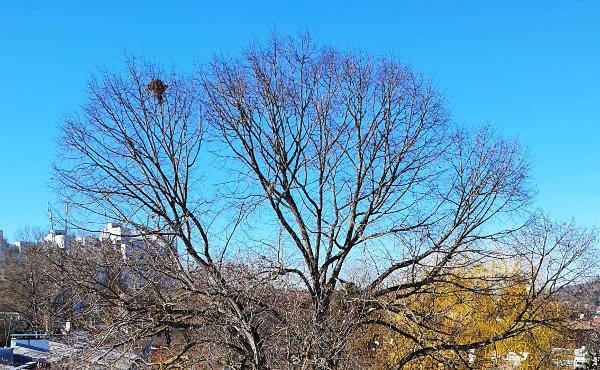

# TreeCam

Right in front of my window there's this wonderful tree which accompanies me through the seasons of the year.

Year after year I think how great it would be to follow this noble tree through the year by taking one picture of it every day.

This is what I came up with:

## The solution

A [Raspberry Pi W](https://www.raspberrypi.org/products/raspberry-pi-zero-w/) (other models work fine as well) with an attached [camera module](https://www.raspberrypi.org/products/camera-module-v2/) serves as the camera device that runs the software that comes with this repo. The software takes pictures and distributes them to different outlets.

Right now there are two services:

1. _Twitter Cam_: can take pictures at pre-defined times of the day and post them on [Twitter](https://twitter.com/)
2. _Timer Cam_: can take pictures in pre-defined intervals and upload them to an FTPS server

Those services are simple pipelines that make use of different features that produce, process or distribute features. New features can easily be added as well as existing features can easily be re-used to create new services.

Please have a look into [the camera module's readme](src/camera/README.md) to learn about the different services and features.

## Robust and user-friendly

* The operating system is [balenaOS](https://www.balena.io/os/) which runs the different modules in Docker containers. _balenaOS_ is very resilient against unexpected power loss and can be updated and maintained via balenaCloud.

* This makes it easy to operate the device in places that are difficult to access. As long as there's a WiFi connection available, you're fine.

* The WiFi connection can be set up via a captive portal.

* The services can easily be configured via a central configuration file.

* New features and services can be added with moderate Python skills.

> Pull Requests that add new features and services are very welcome!

## Setup

See [src/README.md](src/README.md) for instructions how to setup your _TreeCam_ device.

## Contribute

I'd be happy to receive pull requests that add new features and services to TreeCam. For example features that upload pictures to other social media platforms or services that implement new use cases.

Please have a look into the [issues on GitHub](https://github.com/frederikheld/treecam/issues) to see what else is planned that you could support with your skills and time.
