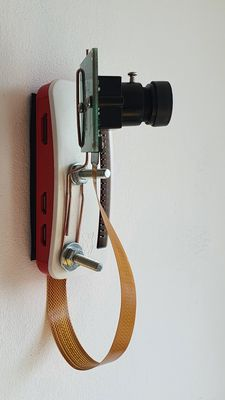
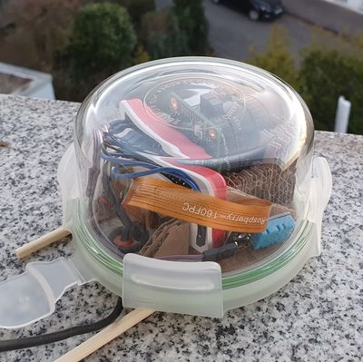

# Setup

## Prepare hardware

Your minimal hardware requirements are:

* a Raspberry Pi that comes with a CSI port (as of 2021, any RasPi except the Raspberry Pi Pico should work fine, e.g. the [RasPi Zero W](https://www.raspberrypi.org/products/raspberry-pi-zero-w/))
* a Raspberry Pi camera module that connects to the CSI port of the Raspberry Pi (e. g. the [Camera Module V2](https://www.raspberrypi.org/products/camera-module-v2/))
* a network interface. The simplest way is to use a RasPi that comes with an integrated ethernet or WiFi interface. If you use a different model, you need to add one via USB. Check the compatibility lists for [WiFi](https://elinux.org/RPi_USB_Wi-Fi_Adapters) and [ethernet](https://elinux.org/RPi_USB_Ethernet_adapters) adapters.
* a 5 V power source (via USB or GPIO)

If you are planning to use the [wifi-reset](./balena-reset) service, you also need to connect a push button to `GPIO4` with a pull-down resistor to `GND`. You can also wire a LED to `GPIO5` if you want to get feedback if the reset command worked fine. You can get this feedback via balenaCloud as well.

If you want to place the RasPi outdoors, you also need a water-proof housing with a window for the camera. If you want to place it inside, any RasPi case works fine.

### Hardware examples

|||
|-|-|
|Example 1: indoors|Example 2: outdoors|
|RasPi Zero W with ArduCam camera module. Improvised cam mount made from paper clip screwed onto the standard RasPi Case. Power via MicroUSB. No reset button.|RasPi Zero W with [RasPi HQ Camera](https://www.raspberrypi.org/products/raspberry-pi-high-quality-camera/) and wide-angle lens. Custom case made out of food container and cardboard. Power via GPIO. Simplified reset button in form of pluggable jumper cables. Additional DHT22 humidity/temperature sensor module to avoid damage thorugh dew water or excessive heat. |

## Install tooling and clone repo

On your computer:

Install [balenaCLI](https://github.com/balena-io/balena-cli/blob/master/INSTALL.md), [Git](https://git-scm.com/book/en/v2/Getting-Started-Installing-Git) and [Docker Engine with Docker CLI and Docker Compose](https://git-scm.com/book/en/v2/Getting-Started-Installing-Git) and a tool to write SD cards like [balenaEtcher](https://www.balena.io/etcher/) or [Raspberry Pi Imager](https://www.raspberrypi.org/software/).

Use Git to clone this repository including submodules:

```sh
$ git clone --recurse-submodules https://github.com/frederikheld/treecam.git
```

Open a terminal and navigate into the `src/` directory of the repository (the directory where this README file is located).

## Configure TreeCam

The configuration is done via `config.json` which is deployed to the devies via balenaCloud. Please have a look into the `README.md` files of each individual service to learn how to configure the _TreeCam_ services.

## Setup balenaCloud

On balenaCloud:

Create a [balenaCloud](https://www.balena.io/cloud/) account and log into it.

Create a new fleet "TreeCam".

On our computer:

Login to balenaCloud on your terminal:

```sh
$ balena login
```

This will provide you with several different authentication methods. Web authorization is the simplest to use. Follow the instructions on the screen.

Check if your fleet is available:

```sh
$ balena fleets
```

This should list your previously created "TreeCam" fleet.

Make sure you're in the `src/` directory. Then push the app from your local repo into the cloud:

```sh
$ balena push TreeCam
```

## Prepare SD card

On balenaCloud:

Create a new device in the previously created fleet "TreeCam". Follow the dialog to download a balenaOS image. You can (but don't need to) specify your WiFi credentials in this dialog. If no WiFi is configured, the device will open a captive portal to configure WiFi credentials on startup.

On your computer:

The download will be a `zip` file that contains an `img` file. Unzip it so that you can work with the `img` file.

The image is an empty balenaOS image that is linked to the "TreeCam" fleet in your account. If you haven't configured WiFi credentials in the process, it won't even be able to pull the app from balenaCloud. This is why we are going to [preload](https://www.balena.io/docs/reference/balena-cli/#preload-image) the image before we flash it to the SD card.

Make sure you're in the `src/` directory and that you have the path where you have downloaded the balenaOS image at hand. Then preload the image:

```sh
$ balena preload /path/to/balena.img --fleet TreeCam --commit current
```

Now write the pre-loaded image to your SD card using an image writer software.

## Install SD card in RasPi

Now put the SD card into your RasPi Zero W.

Make sure that SD card and camera ribbon cable are correctly in place.

> This is the point where the TreeCam device is preapared for it's first start. This would be the condition in which you could give it away to users that do not have development skills. Everything what comes next can be done by the average user.

## First Start

Connect the device to an USB power source. It will start to boot up and indicate with a blink pattern (4 blinks in a row) of the green activity indicator that it is ready. It might take a couple of minutes to get there!

On your computer or mobile phone:

Search for the WiFi `treecam` and connect your device to it.

It will redirect you to a captive portal where you can configure the credentials for the WiFi that will connect the TreeCam device to the internet. If you aren't redirected automatically, open a web browser and navigate to `192.168.3.1`.

Select your home WiFi (or any other WiFi that allows internet access) from the list and provide your WiFi password. Save it.

The device will now shut down the `treecam` WiFi hotspot.

Unplug the device and plug it in again to reboot it. This time it will connect to the configured WiFi and it will show up in balenaCloud after a couple of minutes.

From now on you device should act as configured and make/upload/post pictures.

## Setup TreeCam services

It is planned to add a web interface to configure _TreeCam_ interactively. This will be the replacement for the `config.json` configuration explained above.

Until then, you can change `config.json` on your computer and push the changes to the device via `$ balena push TreeCam` as explained above.

<!-- Check your router for the IP of the "TreeCam" device. -->
